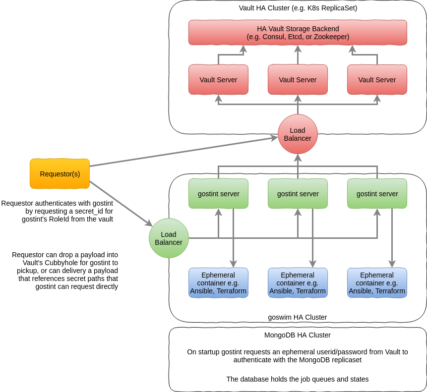
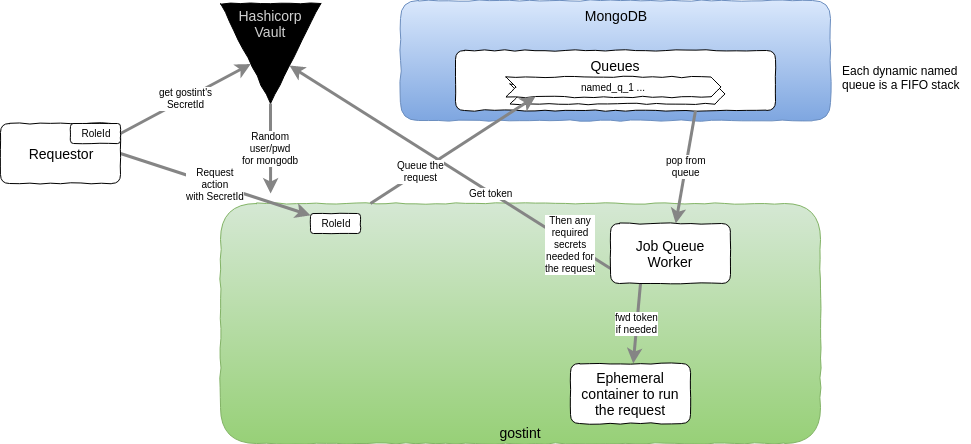

# goswim - A Shallow api for Ansible & Terraform ...
... etc with Hashicorp Vault Integration.

## Bullet points

* Requestor authenticates with goswim via Vault using AppRole auth.
  see https://www.hashicorp.com/blog/authenticating-applications-with-vault-approle

* The resulting token can be passed on to ansible, terraform, or whatever you
  want to drive via the api, so they can retrieve secrets as needed.

* goswim will be immutable AND stateless - no inventory, no history (only yet
  to be pulled results for the requestor).

* ~~any db will be in memory - minimal.~~
* Database will be a HA MongoDB ReplicaSet with access ephemerally authenticated
  via Vault.

* RESTful.

* The requestor + vault will need to provide everything needed for a run.
  (+ paths to secrets in the vault)

* ~~goswim will cache playbook / policy projects - but will remain
  stateless & immutable.  Requestor will inform goswim of what content needs to
  be pulled (https download or git) - if pulling from Artifactory, we may be able
  to pull just the hash to verify if packages need re-pulling.~~

* ~~OR -~~ requestor will pass a zip file of the content to run everytime (these
  need to be kept small), and goswim pulls nothing.

* There is no manifest of playbooks/projects, it simply gets and runs what the
  requestor asks it to do.

* will be containerised.

* execution of content should be in an ephemeral worker container (like with
  Jenkins builds) - can have custom worker containers for technologies other
  than ansible/terraform. Provides separation of duty between the goswim api
  and the content being executed. Also allows to pin versions of ansible etc -
  even supporting multiple versions in parallel.

## API Examples of Requests from a Requestor

### Run an Ansible playbook
```
---
- req:
    type: ansible
    inventory: {...}
    content: "base64 encoded zip of ansible playbook project"
    hostvars: {...} # optional
    groupvars: {...} # optional
    secrets:
      secret_var_1: /path/to/vault/secret_1
      secret_var_2: /path/to/vault/secret_2
      # etc...
```
`secrets` will resolve, via Hashicorp Vault, to ansible variables to be referenced in the playbook.

Secrets could also be looked up using `hashi_lookup()` and the Vault token provided.

### Run a Terraform policy
```
---
- req:
    type: terraform
    content: "base64 encoded zip of a terraform policy project"
    variables: {...}
    secrets:
      secret_var_1: /path/to/vault/secret_1
      secret_var_2: /path/to/vault/secret_2
      # etc...
```

## Conceptual Architecture


## Logical Design


## Ideas

### use Fuse mounts into the containered task runs
see https://github.com/hanwen/go-fuse

Could share/mount unix domain socket and any Vault Token / secrets into the
task container.  Any secrets could be auto-"deleted" when read by the Fuse
subsystem in goswim - i.e. a one-shot share/read operation.
Attempts to re-read a secret should log an alert.
