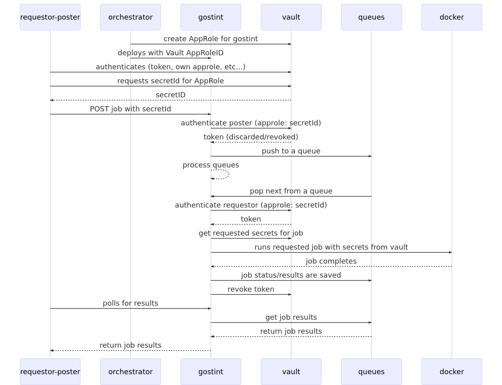
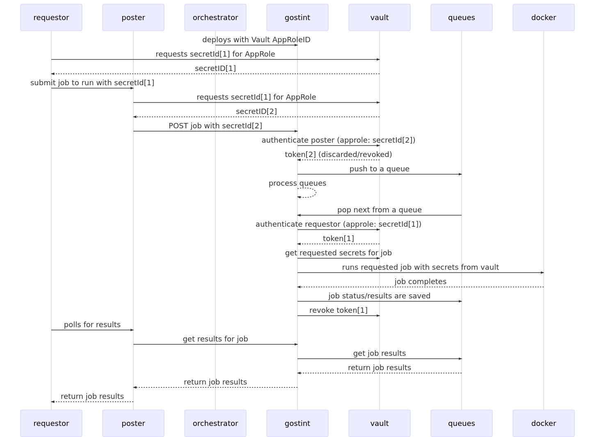
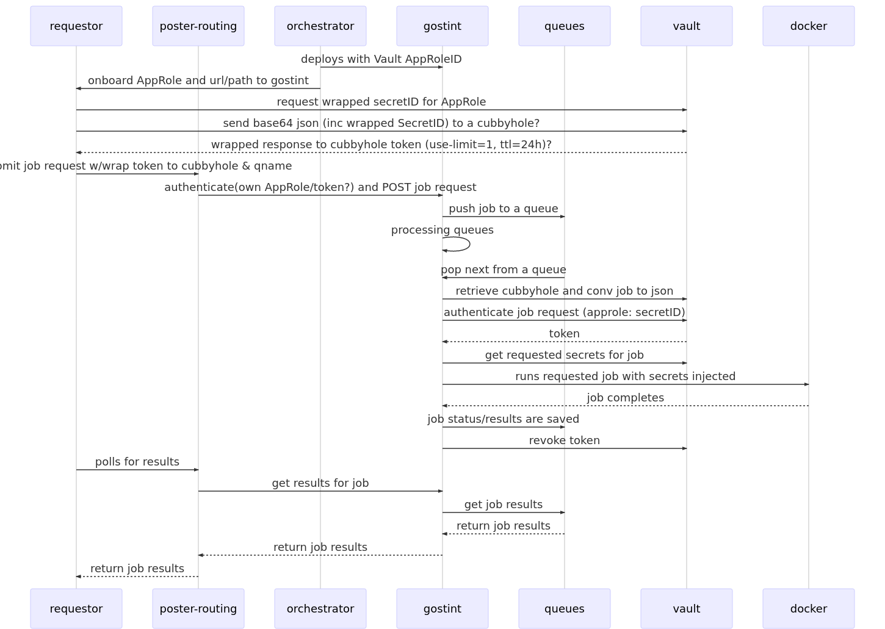
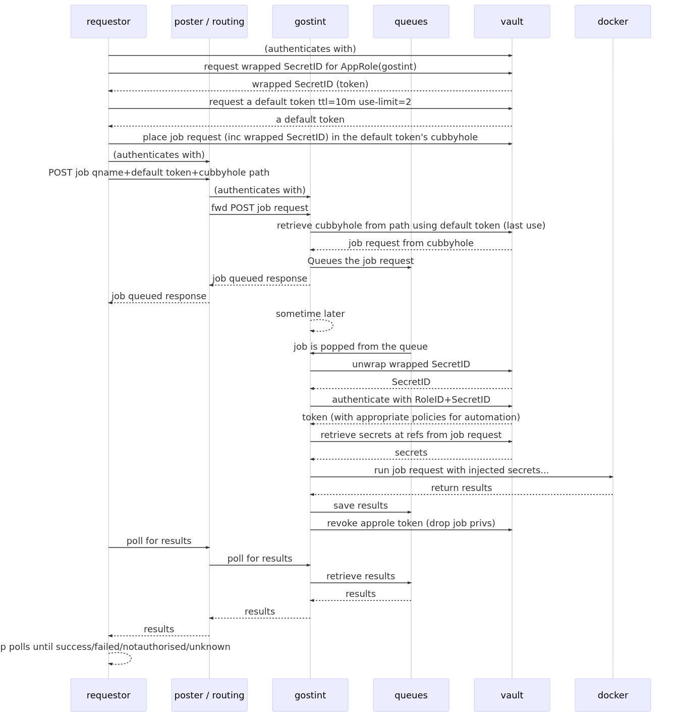
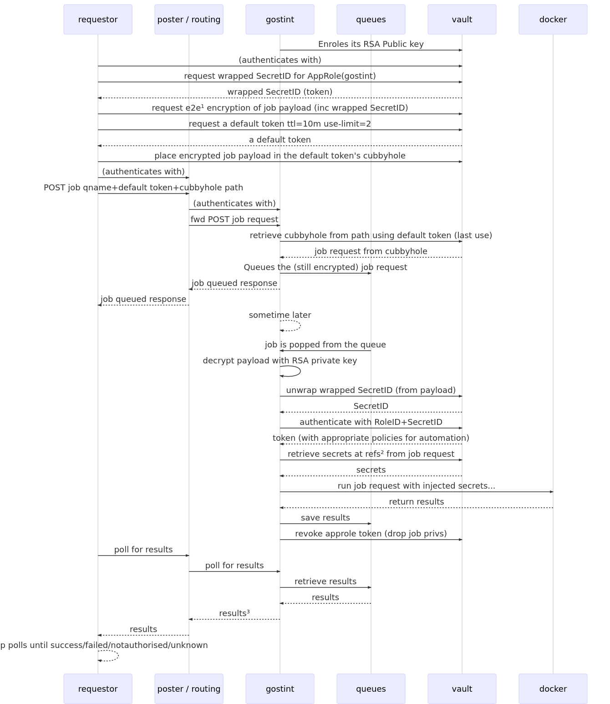
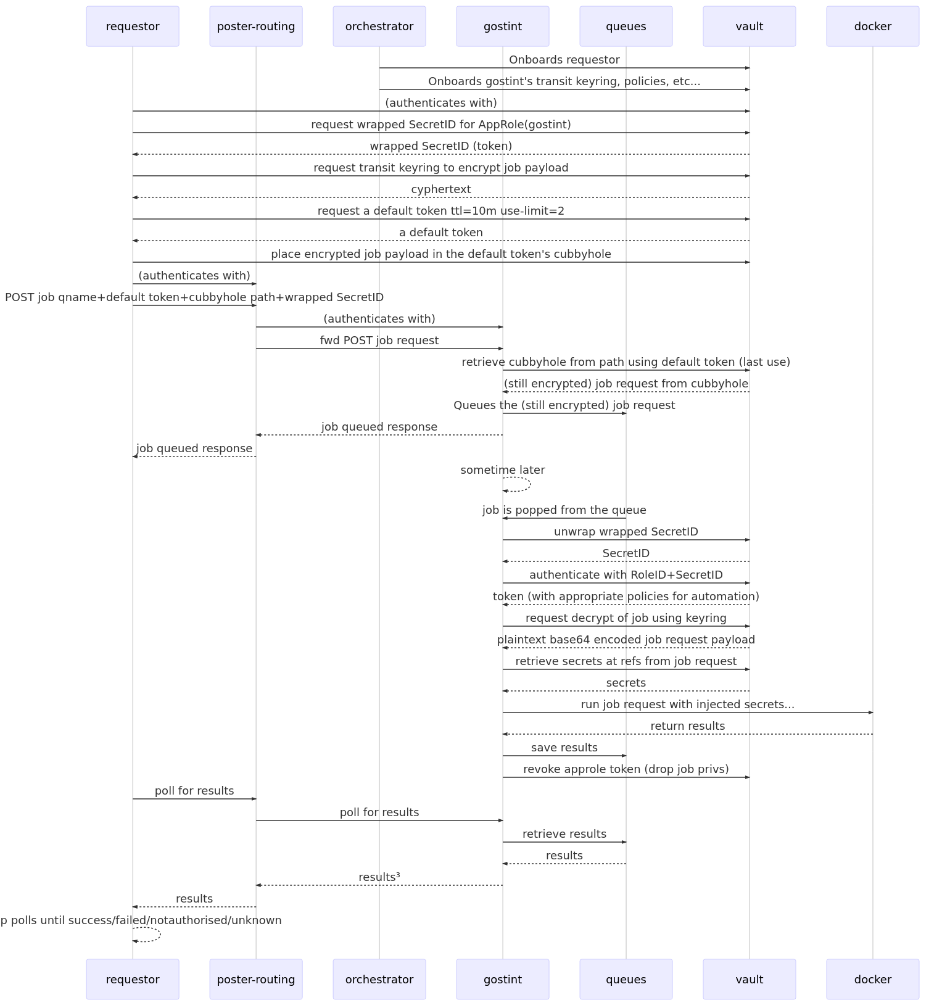

# Job Sequence Diagrams Brainstorming ...
... the Protocol for Traversing Untrusted Networks with Broken TLS Encryption Using Hashicorp Vault.  Note that a simpler way of submitting jobs to gostint can be used if
you have unbroken TLS (either direct or via SNI Routing).


* Requestor and poster here are the same enitity.

## Possible future state with Vault Cubbyhole


* This two step authentication of requestor and poster allows for an intermediary
api routing "middleware" - in future this will be leveraged to support the
requestor posting the job details into a Vault "Cubbyhole" for gostint to pickup,
thereby removing the risk of a man-in-the-middle-attack.

This diagram below includes the cubbyhole interactions:

Policy notes:
* poster must not be able to interact with cubbyholes at all.

Notes:
Creating a cubbyhole for gostint to consume
```
$ vault login root

$ vault token create -policy=default -ttl=60m -use-limit=2
Key                  Value
---                  -----
token                552d3543-ec24-ce3b-05c8-80a0a2abc799
token_accessor       59b87aac-fc4f-04d3-aaec-2560af270e03
token_duration       1h
token_renewable      true
token_policies       ["default"]
identity_policies    []
policies             ["default"]

$ VAULT_TOKEN=552d3543-ec24-ce3b-05c8-80a0a2abc799 vault write cubbyhole/test3 payload="base64 here..."
Success! Data written to: cubbyhole/test3

$ VAULT_TOKEN=552d3543-ec24-ce3b-05c8-80a0a2abc799 vault read cubbyhole/test3
Key        Value
---        -----
payload    base64 here...

$ VAULT_TOKEN=552d3543-ec24-ce3b-05c8-80a0a2abc799 vault read cubbyhole/test3
Error reading cubbyhole/test3: Error making API request.

URL: GET http://127.0.0.1:8200/v1/cubbyhole/test3
Code: 403. Errors:

* permission denied
```

## Options for securely passing job requests through an intermediary (aka the "poster")
(e.g. API GW/Lambda/Routing)

Assumption: all communications to/from the vault are direct using TLS.

Though this approach can highlight/alert on tampering, it still doesnt protect
the posted job content and the AppRole SecretID.  Also it doesnt prevent the
injection of malicious content (using captured SecretID) - assuming the attacker
subverting the poster has sufficient vault access to create a new
cubbyhole.

Next lets look at an end-2-end encryption solution for job requests through an
intermediary using asymmetric encryption...


[&#xb9;] e2e - this can be a multi-step process leveraging the Vault's Transit
secret engine (e.g. create a random key, encrypt payload using AES256GCM, then
encrypt the key using RSA2048 with gostint's RSA public key), or possibly use
my PoC [vault-e2e-plugin](https://github.com/gbevan/vault-e2e-plugin) for Vault.

[&#xb2;] Secret Refs could have already been resolved by the [vault-e2e-plugin](https://github.com/gbevan/vault-e2e-plugin), if used - this
could reduce the number of requests to the vault over the network.

[&#xb3;] Results passing through the intermediary poster could again be
intercepted.  If required, we could again use e2e/transit encryption, but this time
using a requestor's own RSA key pair/transit keyring.

This solution gives us the best of both worlds, namely end-to-end encryption
AND tamper / interception detection during transit through the intermediary
poster / routing.

### Repeat of the above diagram but this time based on new understanding of the transit secret engine.
(This approach was used as the guide for the current release of GoStint)


---

Copyright 2018-2019 Graham Lee Bevan <graham.bevan@ntlworld.com>

<a rel="license" href="http://creativecommons.org/licenses/by/4.0/"></a><br />This work is licensed under a <a rel="license" href="http://creativecommons.org/licenses/by/4.0/">Creative Commons Attribution 4.0 International License</a>.

---
